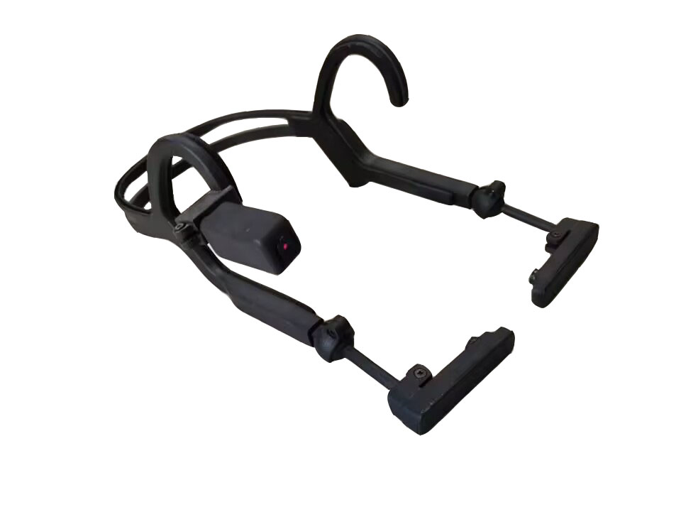
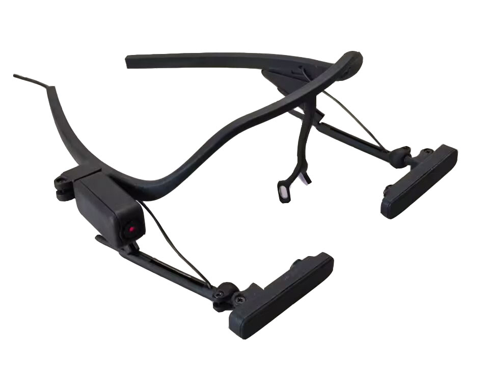
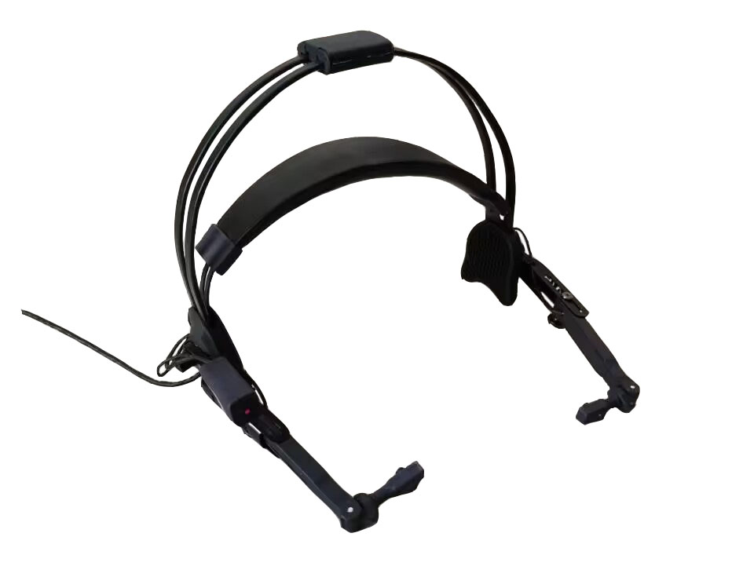

# Ueye

<div>
  
  
  
</div>

**Open source eye tracking platform.** 

Ueye is an active, community driven development project. This project is the upper computer software system of Ueye eye tracker. This project is developed in Python and can be applied to different eye tracker hardware with minimal code changes. Our vision is to create tools for different populations interested in learning eye tracking and conducting eye tracking projects.

## Installing Dependencies and Code

To run the source code, you will need Python 3.6.8 or newer! Due to different library files required, the version of Ubuntu needs to be above 18.04, and the software only supports Ubuntu. 

Note: It is recommended to install the requirements into a [virtual environment](https://docs.python.org/3/tutorial/venv.html). 
It is recommended to modify a local pip mirror if necessary.


## Install system dependencies

Due to the need for other libraries to support the gaze prediction model, the following dependencies need to be installed.

```bash
sudo apt install -y pkg-config git cmake build-essential nasm wget python3-setuptools libusb-1.0-0-dev  python3-dev python3-pip python3-numpy python3-scipy libglew-dev libtbb-dev

# ffmpeg >= 3.2
sudo apt install -y libavformat-dev libavcodec-dev libavdevice-dev libavutil-dev libswscale-dev libavresample-dev ffmpeg x264 x265 libportaudio2 portaudio19-dev

# OpenCV >= 3 + Eigen
sudo apt install -y python3-opencv libopencv-dev libeigen3-dev
```

The above are all the required class libraries. If there are errors or images that cannot be read, please check the version of the library and try to be consistent with the requirements.


## Install system dependencies

Checkout repository from gitee into the directory ueye-desk-linux.

```bash
cd ueye-desk-linux
python3 -m pip install -r requirements.txt
```
We have written the required Python library files in requirements.txt, and all we need to do is install them using pip.


## Insert hardware device

Insert the eye tracker hardware device into the USB interface.

Install v4l2 camera information viewing tool.

```bash
sudo apt-get install v4l-utils
```

Enter the following command to obtain the camera name.

```bash
v4l2-ctl --list-devices
```

After obtaining the camera name, modify the configuration file eyeTrack.yaml.

Add the camera name to the v4l2_name field.


## Run Ueye

```
python3 main.py
```

**prompt**

Due to different encoding methods for eye trackers, it is necessary to change the camera encoding format.

The def init_device(self, device_info) function in the camera.py file located in the device folder.

```bash
 self._device.set(cv2.CAP_PROP_FOURCC,cv2.VideoWriter_fourcc('M','J','P','G'))
```

Some eye trackers default to YUYA encoding, which is extremely slow to read and requires the use of MJPG encoding format.

Use sudo v4l2 ctl -- list devices to read the camera name and path, and make changes in the configuration file eyeTrack.yaml.

The eye movement camera can only reach 480 frames at 320 * 240, while the scene camera needs to set the fps to 25 frames due to unstable frame numbers.

Some cameras v4l2 are not supported and require the use of a supported camera, otherwise it cannot be read, specifically for emoji cameras.


## Usage steps

When entering, the subject information will be input and a save directory will be automatically generated based on the ID. After entering the main interface, data collection will be carried out according to the process, calibration will be performed first, and then data will be recorded. After recording is completed, wait for a few seconds before closing the program.

(Important note: You cannot record again after each recording. You need to restart the program before starting a new recording. After recording, wait a few seconds before closing the program

In the settings interface, only the image gain (infrared power) can be adjusted temporarily. Other parameters are not recommended to be adjusted officially. If necessary, they can be added later


# Aim Where You Look
We have also implemented eye-tracking control for the UAV based on the aforementioned UEYE project.

You simply need to enter the IP address and port of the mobile device, then click the communication button after calibration, to enable flying the UAV using eye-tracking control.

# License
GNU Lesser General Public License (LGPL v3.0)
All source code written by Ueye is open for use in compliance with the [GNU Lesser General Public License (LGPL v3.0)](http://www.gnu.org/licenses/lgpl-3.0.en.html). We want you to change and improve the code -- make a fork! Make sure to share your work with the community!